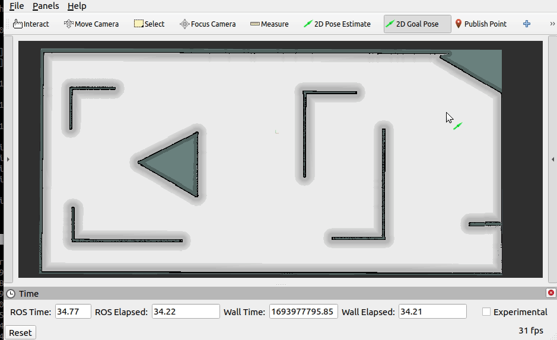

# 全局路径规划仿真二

上一个小节实现了planner server启动脚本的加载，以及相关参数文件的创建，并基于此使用action client命令行的形式进行了功能验证，而日常开发需要更高效的验证方法，这一小节会在`simulator`中实现一个订阅转发工具planner_bridge，用于使用rviz上的控件来完成路径规划的任务下发。

## planner_bridge功能简介

planner_bridge，作为rviz与planner server之间的桥梁，其订阅rviz控件发出的`2D Goal Pose`以及`Publish Point`的消息，然后包装成为action client的消息，向planner server发起规划请求。这样在后续的路径规划调试中，可以很方便的通过rviz控件来反复验证路径效果。 `需要注意的是，到这里为止，尚未实现机器人的重定位功能，所以路径规划的起点都是坐标原点；后面会逐步将里程计，以及机器人重定位功能开发完成之后，就可以随心所欲的进行路径效果验证了。`

- `Publish Point` 用来补充`compute_plan_through_poses`的中间点。

- `2D Goal Pose` 作为路径规划的触发条件，会组合机器人当前位置，`Publish Point`的点序列，以及`2D Goal Pose`的位置。根据目标个数自行选择使用`compute_plan_through_poses`或者是`compute_plan_to_pose`。

## planner_bridge.cpp

在`simulator/src/`目录下创建planner_bridge.cpp文件，并加入如下的内容：

```
#include <chrono>
#include <memory>
#include <rclcpp/rclcpp.hpp>
#include "rclcpp_action/rclcpp_action.hpp"

#include "nav2_msgs/action/compute_path_to_pose.hpp"
#include "nav2_msgs/action/compute_path_through_poses.hpp"
#include "geometry_msgs/msg/point_stamped.hpp"
#include "geometry_msgs/msg/pose_stamped.hpp"

using namespace std::chrono_literals;

namespace simulator{

class PlannerBridge: public rclcpp::Node
{
public:
PlannerBridge()
: rclcpp::Node("planner_bridge")
{
  // 用于订阅rviz中的2d goal pose 话题空间
  goal_sub_ = create_subscription<geometry_msgs::msg::PoseStamped>(
    "goal_pose",
    rclcpp::SystemDefaultsQoS(),
    std::bind(&PlannerBridge::onGoalReceived, this, std::placeholders::_1));

  // 用于订阅rviz中的clicked_point 话题空间
  point_sub_ = create_subscription<geometry_msgs::msg::PointStamped>(
    "clicked_point",
    rclcpp::SystemDefaultsQoS(),
    std::bind(&PlannerBridge::onPointReceived, this, std::placeholders::_1));

  // 用于向planner server发布翻译之后的action 请求,两点间的路劲规划任务
  pose_client_ = rclcpp_action::create_client<nav2_msgs::action::ComputePathToPose>(
      this,
      "compute_path_to_pose");

  // 用于向planner server发布翻译之后的action 请求,多个途经点间的路劲规划任务
  poses_client_ = rclcpp_action::create_client<nav2_msgs::action::ComputePathThroughPoses>(
      this,
      "compute_path_through_poses");
}

protected:
// 翻译rviz中发来的目标信息，并组织action client的请求消息后，对planner server发出请求。
void onGoalReceived(const geometry_msgs::msg::PoseStamped::SharedPtr pose)
{
  if(poses_.size() > 0){
    poses_.push_back(*pose);
    auto goal_msg = nav2_msgs::action::ComputePathThroughPoses::Goal();
    auto send_goal_options = rclcpp_action::Client<nav2_msgs::action::ComputePathThroughPoses>::SendGoalOptions();
    
    goal_msg.goals = poses_;

    if (!poses_client_->wait_for_action_server()) {
      RCLCPP_ERROR(get_logger(), "Action server %s not available after waiting", "compute_path_through_pose");
      return;
    }    
    poses_client_->async_send_goal(goal_msg, send_goal_options);
  }else{
    auto goal_msg = nav2_msgs::action::ComputePathToPose::Goal();
    auto send_goal_options = rclcpp_action::Client<nav2_msgs::action::ComputePathToPose>::SendGoalOptions();
    goal_msg.goal = *pose;
    if (!pose_client_->wait_for_action_server()) {
      RCLCPP_ERROR(get_logger(), "Action server %s not available after waiting", "compute_path_to_pose");
      return;
    }    
    pose_client_->async_send_goal(goal_msg, send_goal_options);
  }
  poses_.clear();
}

void onPointReceived(const geometry_msgs::msg::PointStamped::SharedPtr pose)
{
  geometry_msgs::msg::PoseStamped p;
  p.header = pose->header;
  p.pose.position.x = pose->point.x;
  p.pose.position.y = pose->point.y;
  poses_.push_back(p);
}

private:

std::vector<geometry_msgs::msg::PoseStamped> poses_;

rclcpp::Subscription<geometry_msgs::msg::PoseStamped>::SharedPtr goal_sub_;
rclcpp::Subscription<geometry_msgs::msg::PointStamped>::SharedPtr point_sub_;

rclcpp_action::Client<nav2_msgs::action::ComputePathToPose>::SharedPtr pose_client_;
rclcpp_action::Client<nav2_msgs::action::ComputePathThroughPoses>::SharedPtr poses_client_;
};
}

int main(int argc, char * argv[])
{
  rclcpp::init(argc, argv);
  auto planner_bridge = std::make_shared<simulator::PlannerBridge>();
  rclcpp::spin(planner_bridge->get_node_base_interface());
  rclcpp::shutdown();
  return 0;
}

```

## CMakeList.txt

将planner_bridge.cpp加入到编译系统中，并添加相关依赖：
```
find_package(nav2_msgs REQUIRED)
find_package(rclcpp_action REQUIRED)
 
 set(dependencies
   rclcpp
   rosgraph_msgs
   geometry_msgs
  nav2_msgs
  rclcpp_action
 )
...

add_executable(planner_bridge src/planner_bridge.cpp)
target_include_directories(planner_bridge PUBLIC
  $<BUILD_INTERFACE:${CMAKE_CURRENT_SOURCE_DIR}/include>
  $<INSTALL_INTERFACE:include>)
target_compile_features(planner_bridge PUBLIC c_std_99 cxx_std_17)  # Require C99 and C++17
ament_target_dependencies(
  planner_bridge
  ${dependencies}
)

install(TARGETS clock_node telecontrol planner_bridge
   DESTINATION lib/${PROJECT_NAME})


```

## package.xml
加入相关的依赖包

```
...
  <depend>nav2_msgs</depend>
  <depend>rclcpp_action</depend>
...

```

## launch.py
将planner_bridge节点加入到启动脚本里。

```
...        
        # rviz控件指令桥接器，用于planner server指令翻译发送
        Node(
           package='simulator',
           executable='planner_bridge',
           name='planner_bridge',
           parameters=[{'use_sim_time': True}],
           output='screen'
           ),           
...
```
## 效果验证

分别启动两个终端，确保所有的环境都source过之后，分别执行如下两个启动脚本：

```
ros2 launch simulator planner_simulator.launch.py
ros2 launch planner planner.launch.py
```

通过`2D Goal Pose`以及`Publish Point`两个控件分别做路径目标的设置之后，可以看到如下的仿真效果：

